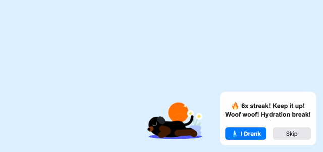
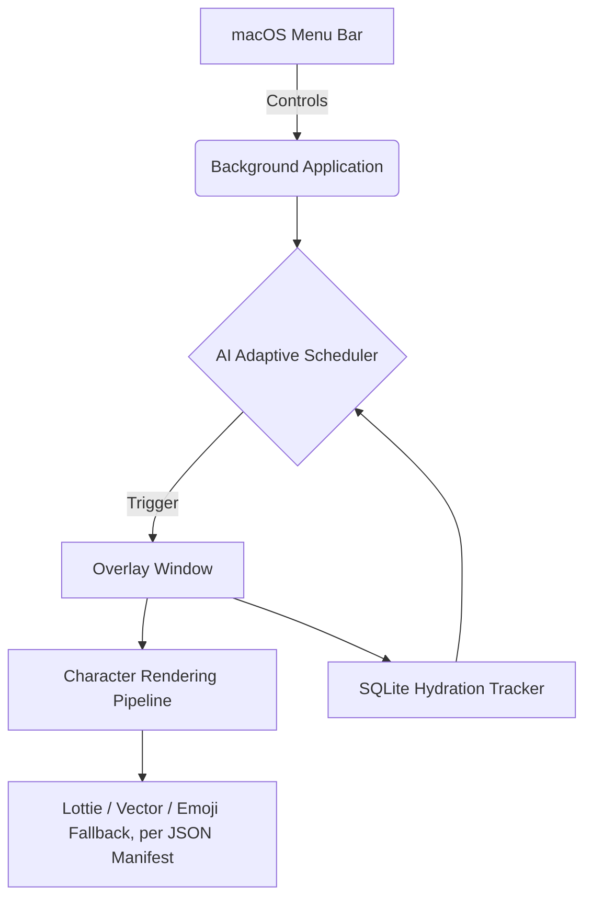
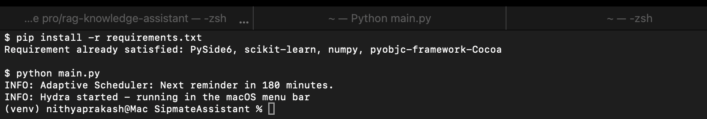
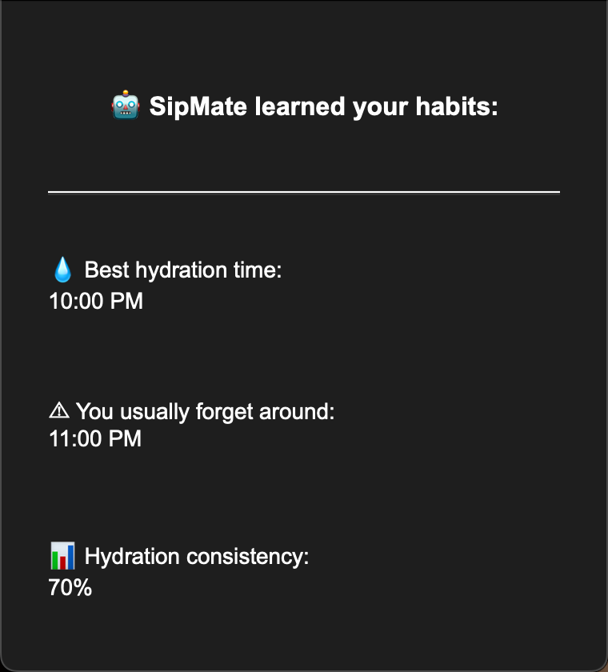

# SipMate
**AI-Powered Animated Wellness Companion**

SipMate is not just another boring notification app. It's a magical desktop companion built for macOS that reminds you to hydrate through delightful, non-intrusive animated characters that float across your screen. 

Powered by local AI and strict macOS overlay policies, SipMate ensures you stay hydrated without ever breaking your flow.

---

##  Features

- **8 SipMate Originals**: Dog, Ghost, Aeroplane, Cat, Penguin, Frog, Rocket, and Sloth - each a real illustrated Lottie animation with its own personality, sound effect, and entrance behavior.
- **Soft, Disney-style Motion**: Characters cross the full screen on arced, bouncy paths (not flat linear slides) and land with a squash-and-stretch bounce; any character without illustrated artwork yet falls back gracefully to hand-drawn vector art or a soft gradient emoji badge instead of breaking.
- **A Sound for Every Character**: Each reminder plays its own short sound effect - a bark, a meow, a launch whoosh - toggleable from Settings.
- **Character Collection & Selection Modes**: Browse, favorite, preview, and pick a character from a dedicated collection window; choose Random, Single Character, Daily Rotation, Favorites, or SipMate Originals-only from Settings.
- **Unobtrusive Overlay**: Characters float natively over full-screen applications (like VS Code, Chrome, or Spotify) without stealing your keyboard focus or cluttering your Dock.
- **AI Adaptive Scheduling**: SipMate learns your habits. A local Logistic Regression model analyzes when you accept or skip water breaks and dynamically adjusts the schedule to your optimal hydration times.
- **Dynamic Messaging**: Characters have personalities! Messages adapt based on your current hydration streak and the time of day, and never repeat the same line twice in a row.
- **Rich Insights Dashboard**: Track your consistency, best hydration hours, and missed times.

##  Demo



*Dog, rocket, and cat reminders back to back - real illustrated animations, personality-driven messages, and the drink response.*

---

##  Architecture

SipMate is completely background-driven, utilizing `PySide6` for its UI layer and raw `macOS AppKit` APIs to manipulate the window server.



### Tech Stack
- **Python 3.10+**
- **PySide6** (Qt for Python)
- **PyObjC** (macOS Native Window bindings)
- **scikit-learn** (Local ML modeling)
- **SQLite3** (Persistence)

---

##  Installation

1. Clone the repository:
   ```bash
   git clone git@github.com:nithya-prakash/SipmateAssistant.git
   cd SipmateAssistant
   ```

2. Set up a virtual environment:
   ```bash
   python3 -m venv venv
   source venv/bin/activate
   ```

3. Install dependencies:
   ```bash
   pip install -r requirements.txt
   ```

4. Run SipMate:
   ```bash
   python main.py
   ```

   SipMate runs quietly in the menu bar - a successful launch looks like this:

   

---

## 🖥️ Platform support

| Platform | Status | Mechanism |
|---|---|---|
| macOS | **Built and verified** on real hardware — confirmed the overlay stays above other apps (Chrome, VS Code, ...) across app switches and Spaces | `core/mac_overlay.py`: PyObjC sets `NSScreenSaverWindowLevel`, `NSWindowCollectionBehaviorCanJoinAllSpaces`/`FullScreenAuxiliary`, `hidesOnDeactivate=NO`; `NSApplicationActivationPolicyAccessory` hides the Dock icon |
| Windows | **Best-effort, unverified** — this project has only ever run on macOS, there is no Windows machine to test on | `core/windows_overlay.py`: `pywin32`, `SetWindowPos(HWND_TOPMOST)` + `WS_EX_NOACTIVATE` + `WS_EX_TOOLWINDOW` |
| Linux | **Best-effort, unverified**, and the roughest of the three — Linux WM behavior is inherently the least uniform | `core/linux_overlay.py`: raw Xlib, `_NET_WM_STATE_ABOVE` + `_NET_WM_STATE_SKIP_TASKBAR` EWMH hints (X11/XWayland only — no native-Wayland equivalent exists via Qt's `winId()`) |

`core/overlay_platform.py` is the single dispatch point the app actually calls;
it picks the right module by `sys.platform` and never lets a missing
platform dependency or a failed call crash the app — worst case, the overlay
just falls back to plain Qt always-on-top with no OS-native reinforcement.

---

## 🤖 AI Features

SipMate puts privacy first. It does not send your data to the cloud.
- **Adaptive Scheduler — actually evaluated, not just fit**: `ai/model_evaluator.py`
  fits both `LogisticRegression` and `RandomForestClassifier` on cyclically-encoded
  hour/day-of-week features, cross-validates each with stratified k-fold (this is a
  small, single-user dataset, so a single train/test split would be too noisy to
  trust), and keeps whichever one actually generalizes better on held-out folds —
  reported by accuracy, precision, recall, and ROC-AUC, plus a permutation-importance
  summary of which factor (time of day vs. day of week) the winning model leans on
  most. All of this is surfaced in the AI Insights window, not just used silently.
  Below the training threshold (20 samples, ≥3 of each outcome, enough per class to
  cross-validate) it stays honestly "not trained yet" and falls back to your fixed
  reminder interval — an AI failure or a cold start never stops reminders.
- **Insights Engine**: Parses your local SQLite history to calculate consistency
  metrics and ranks hours by *success rate* (accepted / shown), not raw volume, with
  a minimum-sample reliability filter so a single lucky accept can't look like a
  perfect hour.
- **Procedural Personalities**: The Message Generator synthesizes text using templates driven by your active streak (e.g., "🔥 3x streak!").



*The AI Insights dashboard (tray menu → AI Insights Dashboard), built from real logged reminders - best hydration hour, when you tend to forget, and overall consistency.*

---

##  Character Engine

SipMate's characters are completely data-driven - the `CharacterRegistry` loads every manifest in `characters/manifests/`, and `RendererFactory` picks how each one gets drawn. Adding a new character takes only a JSON file, no code changes:

```json
{
  "id": "rocket",
  "name": "Rocket",
  "emoji": "🚀",
  "category": "sipmate_original",
  "personality": "Energetic, motivational",
  "renderer": "lottie",
  "asset": "rocket.json",
  "movement_style": "launch_upward",
  "animation_type": "launch",
  "messages": [
    "3… 2… 1… HYDRATE!",
    "Prepare for hydration launch!",
    "Fuel your body for liftoff!",
    "Mission objective: drink water!"
  ],
  "sound": "rocket.mp3"
}
```

- **`renderer`** is `"lottie"` for a real illustrated animation (`asset` points to a file in `assets/characters/`), or `"static_image"` to use a PNG with graceful fallback to hand-drawn vector art or an emoji badge if no asset exists yet.
- **`movement_style`** drives how the character crosses the screen (`walk_across`, `fly_across`, `float`, `launch_upward`, ...) - entrance and exit share one random side-to-side crossing, not a peek-in-and-retreat.
- **`animation_type`** drives its idle motion once it lands (`bounce`, `float`, `pulse`, `hop`, `sway`, ...), reused across characters rather than hand-authored per character.
- **`sound`** points to a short effect in `sounds/effects/`, played through `AudioPlayer` on every reminder.

---

##  Future Roadmap

- Additional character packs (Seasonal: Santa, Pumpkin), with real illustrated art sourced for each before they ship.
- Multi-monitor explicit targeting (choosing which display the character appears on).
- Apple HealthKit synchronization.

*Stay hydrated! 💧*
