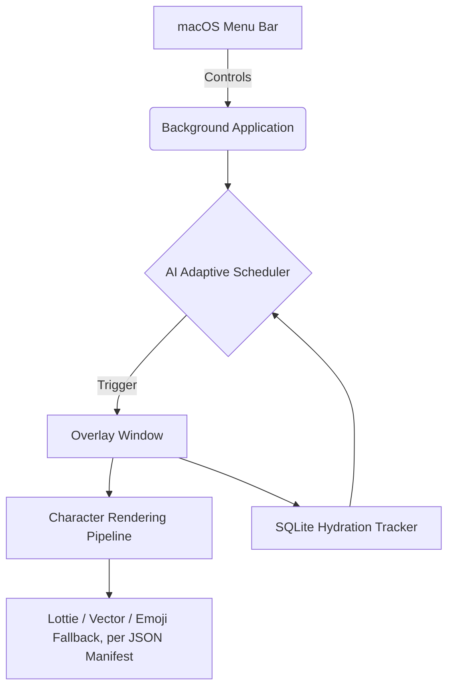

# SipMate
**AI-Powered Animated Wellness Companion**

SipMate is not just another boring notification app. It's a magical desktop companion built for macOS that reminds you to hydrate through delightful, non-intrusive animated characters that float across your screen. 

Powered by local AI and strict macOS overlay policies, SipMate ensures you stay hydrated without ever breaking your flow.

---

##  Features

- **8 SipMate Originals**: Dog, Ghost, Aeroplane, Cat, Penguin, Frog, Rocket, and Sloth — real illustrated Lottie animations, each with its own personality, sound, and entrance.
- **Soft, Disney-style Motion**: arced, bouncy crossing paths with a squash-and-stretch landing; characters without art fall back to vector or an emoji badge.
- **A Sound for Every Character**: bark, meow, launch whoosh — toggleable from Settings.
- **Character Collection & Selection Modes**: browse, favorite, and preview characters; pick Random, Single, Daily Rotation, Favorites, or Originals-only.
- **Unobtrusive Overlay**: floats above full-screen apps (VS Code, Chrome, Spotify, ...) without stealing focus or a Dock icon.
- **AI Adaptive Scheduling**: cross-validated model picks your optimal reminder times from real accept/skip history.
- **Dynamic Messaging**: streak- and time-aware, never repeats the same line twice in a row.
- **Rich Insights Dashboard**: consistency, best hydration hours, and when you tend to forget.

##  Demo


*Dog, rocket, and cat reminders back to back - real illustrated animations, personality-driven messages, and the drink response.*

---

##  Architecture

Background-driven: `PySide6` for the UI layer, raw `macOS AppKit` APIs to manipulate the window server.



### Tech Stack
- **Python 3.10+**
- **PySide6** (Qt for Python)
- **PyObjC** (macOS Native Window bindings)
- **scikit-learn** (Local ML modeling)
- **SQLite3** (Persistence)

---

##  Installation

1. Clone the repository:
   ```bash
   git clone git@github.com:nithya-prakash/SipmateAssistant.git
   cd SipmateAssistant
   ```

2. Set up a virtual environment:
   ```bash
   python3 -m venv venv
   source venv/bin/activate
   ```

3. Install dependencies:
   ```bash
   pip install -r requirements.txt
   ```

4. Run SipMate:
   ```bash
   python main.py
   ```

   SipMate runs quietly in the menu bar - a successful launch looks like this:

   

---

## 🖥️ Platform support

| Platform | Status | Mechanism |
|---|---|---|
| macOS | **Verified** on real hardware — overlay stays above other apps across app switches and Spaces | `core/mac_overlay.py` (PyObjC: window level, collection behavior, `hidesOnDeactivate`) |
| Windows | Best-effort, unverified | `core/windows_overlay.py` (`pywin32`: `HWND_TOPMOST`, `WS_EX_NOACTIVATE/TOOLWINDOW`) |
| Linux | Best-effort, unverified, least uniform (WM-dependent) | `core/linux_overlay.py` (raw Xlib EWMH hints, X11/XWayland only) |

`core/overlay_platform.py` dispatches by `sys.platform` and never lets a missing
dependency crash the app — worst case it falls back to plain Qt always-on-top.

---

## 🤖 AI Features

SipMate puts privacy first — nothing leaves your machine.
- **Adaptive Scheduler**: `ai/model_evaluator.py` cross-validates `LogisticRegression`
  against `RandomForestClassifier` on your reminder history and keeps whichever
  generalizes better (accuracy/precision/recall/ROC-AUC, plus which factor — time of
  day or day of week — it leans on), surfaced in the Insights window. Below the
  training threshold it stays honestly "not trained yet" and falls back to your fixed
  interval — an AI failure never stops reminders.
- **Insights Engine**: ranks hours by *success rate* (accepted/shown), not raw
  volume, with a minimum-sample filter so one lucky accept can't look like a perfect hour.
- **Procedural Personalities**: streak- and time-aware message templates (e.g., "🔥 3x streak!").


*The AI Insights dashboard (tray menu → AI Insights Dashboard), built from real logged reminders - best hydration hour, when you tend to forget, and overall consistency.*

---

##  Character Engine

Data-driven: `CharacterRegistry` loads every manifest in `characters/manifests/`, and `RendererFactory` picks how each one gets drawn. Adding a character takes only a JSON file, no code changes:

```json
{
  "id": "rocket",
  "name": "Rocket",
  "emoji": "🚀",
  "category": "sipmate_original",
  "personality": "Energetic, motivational",
  "renderer": "lottie",
  "asset": "rocket.json",
  "movement_style": "launch_upward",
  "animation_type": "launch",
  "messages": [
    "3… 2… 1… HYDRATE!",
    "Prepare for hydration launch!",
    "Fuel your body for liftoff!",
    "Mission objective: drink water!"
  ],
  "sound": "rocket.mp3"
}
```

- **`renderer`**: `"lottie"` for illustrated animation, or `"static_image"` (falls back to vector/emoji if the asset's missing).
- **`movement_style`**: how it crosses the screen (`walk_across`, `fly_across`, `float`, `launch_upward`, ...).
- **`animation_type`**: its idle motion once landed (`bounce`, `float`, `pulse`, `hop`, `sway`, ...), shared across characters.
- **`sound`**: a short effect in `sounds/effects/`, played via `AudioPlayer`.

---

##  Future Roadmap

- Additional character packs (Seasonal: Santa, Pumpkin), with real illustrated art sourced for each before they ship.
- Multi-monitor explicit targeting (choosing which display the character appears on).
- Apple HealthKit synchronization.

*Stay hydrated! 💧*
