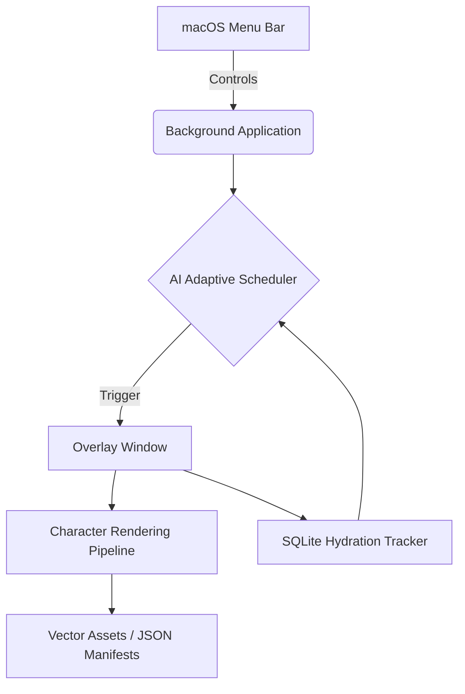

# SipMate
**AI-Powered Animated Wellness Companion**

SipMate is not just another boring notification app. It's a magical desktop companion built for macOS that reminds you to hydrate through delightful, non-intrusive animated characters that float across your screen. 

Powered by local AI and strict macOS overlay policies, SipMate ensures you stay hydrated without ever breaking your flow.

---

##  Features

- **15 Unique Animated Characters**: From a propeller-spinning airplane to a fire-breathing dragon, every reminder is a surprise.
- **Soft, Disney-style Motion**: Characters fly and walk in on arced, bouncy paths (not flat linear slides), land with a squash-and-stretch bounce, and are shaded with soft gradient highlights and a grounding drop shadow instead of flat vector fills.
- **Unobtrusive Overlay**: Characters float natively over full-screen applications (like VS Code, Chrome, or Spotify) without stealing your keyboard focus or cluttering your Dock.
- **AI Adaptive Scheduling**: SipMate learns your habits. A local Logistic Regression model analyzes when you accept or skip water breaks and dynamically adjusts the schedule to your optimal hydration times.
- **Dynamic Messaging**: Characters have personalities! Messages adapt based on your current hydration streak and the time of day.
- **Rich Insights Dashboard**: Track your consistency, best hydration hours, and missed times.

##  Demo


*Dog, rocket, and cat reminders back to back - real illustrated animations, personality-driven messages, and the drink response.*

---

##  Architecture

SipMate is completely background-driven, utilizing `PySide6` for its UI layer and raw `macOS AppKit` APIs to manipulate the window server.



### Tech Stack
- **Python 3.10+**
- **PySide6** (Qt for Python)
- **PyObjC** (macOS Native Window bindings)
- **scikit-learn** (Local ML modeling)
- **SQLite3** (Persistence)

---

##  Installation

1. Clone the repository:
   ```bash
   git clone git@github.com:nithya-prakash/SipmateAssistant.git
   cd SipmateAssistant
   ```

2. Set up a virtual environment:
   ```bash
   python3 -m venv venv
   source venv/bin/activate
   ```

3. Install dependencies:
   ```bash
   pip install -r requirements.txt
   ```

4. Run SipMate:
   ```bash
   python main.py
   ```

   SipMate runs quietly in the menu bar - a successful launch looks like this:

   

---

##  AI Features

SipMate puts privacy first. It does not send your data to the cloud.
- **Insights Engine**: Parses your local SQLite history to calculate consistency metrics.
- **scikit-learn Scheduler**: Uses binary classification on your hydration logs (accepted vs skipped) based on the hour of the day to predict the highest probability of you drinking water.
- **Procedural Personalities**: The Message Generator synthesizes text using templates driven by your active streak (e.g., "🔥 3x streak!").

---

##  Character Engine

SipMate's characters are completely data-driven. Adding a new character takes only a few lines in a JSON manifest!

```json
{
 "id": "rocket",
 "renderer": "vector",
 "behavior": "launch_upward",
 "personality": "energetic",
 "messages": ["Blast off to hydration! 🚀"],
 "effects": ["fire_particles"],
 "duration": 8
}
```
The renderer dynamically attaches `QPropertyAnimation` sequences like `launch_upward`, `fly_across`, or `walk_to_center` based on the JSON configuration.

---

##  Future Roadmap

- Additional character packs (Seasonal: Santa, Ghost).
- Sound pack expansions.
- Multi-monitor explicit targeting (choosing which display the character appears on).
- Apple HealthKit synchronization.

*Stay hydrated! 💧*
